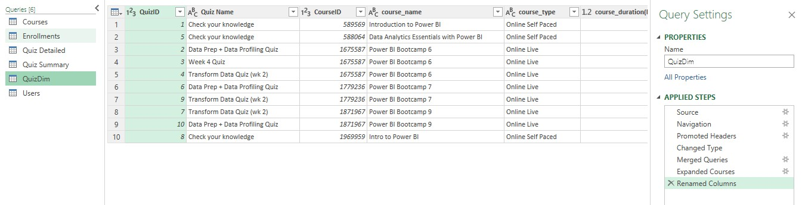

# E-learning analysis with MS Excel

Foresight BI & Analytics is a Consulting & Training Firm. They specialize in developing Microsoft Power BI Reporting Solutions and Training for Individuals and Organizations.The Firm has some Self-Paced Courses hosted on a Learning Management System (LMS). The Analytics provided by the LMS application does not provide enough information required by Management.They can extract some Data from the app that includes Students Enrollments and Students Quizzes. Foresight BI hopes to use the Data to improve Student Engagement, Marketing, and the course curriculum.

## Project problem
The Analytics provided by the LMS application does not provide enough information required by Management.

## Project goal
To provide enough information from extracted data to improve student engagement, marketing, and course curriculum

## Defining the problem
Student engagement refers to the extent to which students are actively involved and motivated to attend classes, and complete assignments and courses. Topics to be covered, assignments, and course resources are all part of the course curriculum. Therefore improving the course curriculum will improve student engagement

## Data extracted from the app
click [here](https://docs.google.com/spreadsheets/d/1M3INoxFT5tzmjaDOS68TG4xfx7x4LERd/edit#gid=574660071) to access the data

## Metadata

#### Tables structures
* Courses - (27 rows, 4 columns)
* QuizDim - (10 rows, 3 columns)
* Users - (1280 rows, 4 columns)
* Enrollment - (1850 rows, 10 columns)
* Quiz Detailed - (5394 rows, 6 columns)
* Quiz summary - (1084 rows, 6 columns)

## Data analysis plan
#### Tool Used
The tool used for this project is MS Excel. Excel was used because the data was small, simple analysis and basic charts were used
#### Data manipulation
Power query was used for data cleaning, data transformation, and data merging. The fields used in the analysis were clean.
* Data transformation – fields with date, data type was changed from date-time to date and a new name column was created

* Data merging – enrollment and course datasets were merged also quizdim and course were merged

enrollment and course      | QuizDim and course
:-------------------------:|:-------------------------:
   |                        

## Data modeling

It was achieved by using a power pivot

## Exploratory data analysis
Pivot tables and pivot charts were used to summarize data and identify trends and patterns

### Report visuals

To interact with a report click [here](https://1drv.ms/x/s!AkvFVdfC21wYhFqbVoFeqh8XO6xD)

## Insights
* Many of the students who enrolled in courses didn’t complete them, about 1390 course enrollments haven’t being completed.
* Introduction to Power BI is the course with many enrollments, it has 809 enrollments out of 1850 enrollments.
* Students taking Online self-paced course type many of them didn’t complete the courses compared to online live course type
* Students taking Courses with a course duration of 2.5 hours many of them didn’t complete the courses compared to courses with a course duration of 48 hours.  This means long course duration isn’t the biggest problem but course content
* Introduction to Power BI and Intro to Power BI are the courses with 2.5 hours of course duration and all Power BI boot camp courses from 1 to 10 have 48 hours of duration.
* Out of the 27 courses available, only 22 courses have been enrolled. Power BI boot camp 8, Microsoft Excel recruitment test, Excel business intelligence course, Data Analytics essentials, and DA100 practice questions are the courses that don’t have any enrollments
* Course enrollments have been declining from 2020 up to 2022
* Out of 22 enrolled courses, only 6 courses have quizzes 

## Recommendations 
* Introduction to Power BI and Intro to Power BI courses should be added to Power BI boot camps which have good performance in completion rate. This will reduce the rate of incomplete enrollment
* All courses should have either quizzes or tests and all of them should be conducted in an online live type
* The firm should conduct research on courses with no enrollments to get their relevancy and use influencers and data enthusiasts to market their services  
