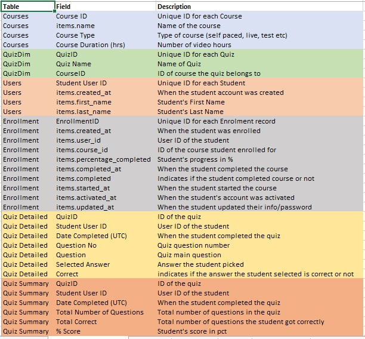
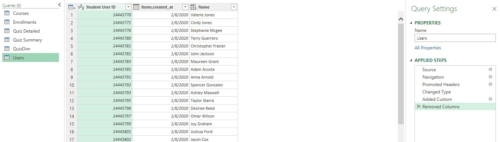
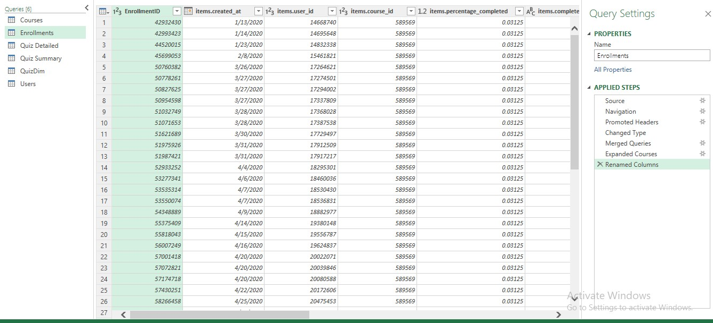
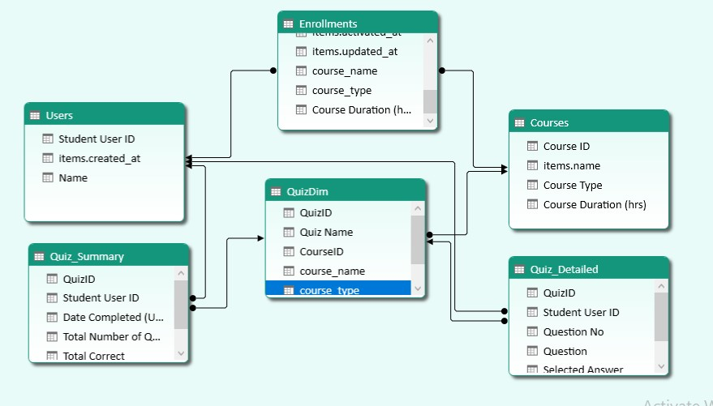
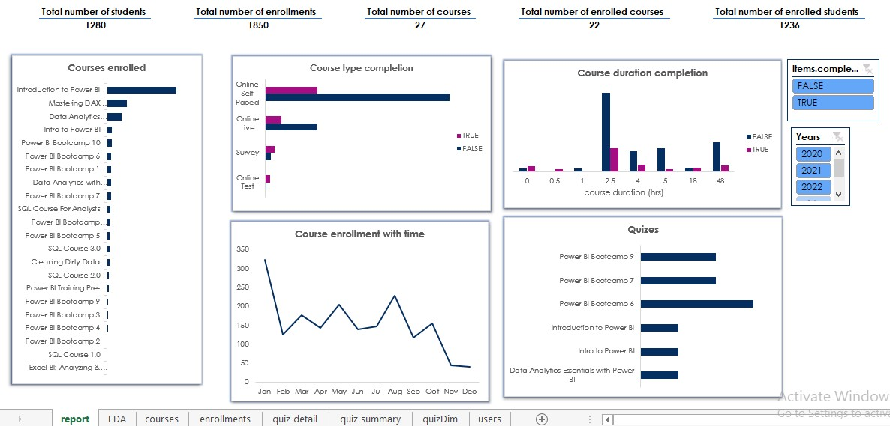

# E-learning analysis with MS Excel

Foresight BI & Analytics is a Consulting & Training Firm. They specialize in developing Microsoft Power BI Reporting Solutions and Training for Individuals and Organizations.The Firm has some Self-Paced Courses hosted on a Learning Management System (LMS). The Analytics provided by the LMS application does not provide enough information required by Management.They can extract some Data from the app that includes Students Enrollments and Students Quizzes. Foresight BI hopes to use the Data to improve Student Engagement, Marketing, and the course curriculum.

## Project problem
The Analytics provided by the LMS application does not provide enough information required by Management.

## Project goal
To provide enough information from extracted data to improve student engagement, marketing, and course curriculum

## Possible questions to achieve the project goal
Assumption: there is low students engagements/enrollment in courses and tests 

* Why low student engagement/enrollments?  Irrelevant courses
* Why Irrelevant courses? Irrelevant courses can be caused by the irrelevant course curriculum 
* Why an Irrelevant course curriculum? Irrelevant topics covered, resources used, assessments, mode of instructions

Therefore improving course curriculum will improve students engagement

## Data extracted from the app
click [here](https://docs.google.com/spreadsheets/d/1M3INoxFT5tzmjaDOS68TG4xfx7x4LERd/edit#gid=574660071) to access the data

## Metadata

#### Tables structures
* Courses - (27 rows, 4 columns)
* QuizDim - (10 rows, 3 columns)
* Users - (1280 rows, 4 columns)
* Enrollment - (1850 rows, 10 columns)
* Quiz Detailed - (5394 rows, 6 columns)
* Quiz summary - (1084 rows, 6 columns)

## Data analysis plan
#### Tool Used
The tool used for this project is MS Excel. Excel was used because the data was small, simple analysis and basic charts were used
#### Data manipulation
Power query was used for data cleaning, data transformation, and data merging. The fields used in the analysis were clean.
* Data transformation – fields with date, data type was changed from date-time to date and a new name column was created

* Data merging – enrollment and course datasets were merged also quizdim and course were merged

 |
-------------------------|------------------------------
## Data modeling

It was achieved by using a power pivot

## Exploratory data analysis
Pivot tables and pivot charts were used to summarize data and identify trends and patterns

### Report visuals

To interact with a report click [here](https://1drv.ms/x/s!AkvFVdfC21wYhFqbVoFeqh8XO6xD)

## Insights

## Recommendations 
